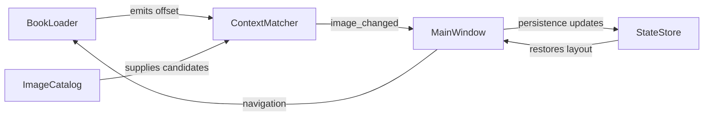

# Architecture Blueprint

This document captures the reader, matcher, and UI surface that drive the StoryGlass experience.

## Core Layers

### 1. Data & Domain Layer
- `reader_app.reader.BookLoader` ingests plain text, EPUB, or Markdown books; it segments content into chapters, paragraphs, and annotated offsets, then exposes navigation signals (`chapter_changed`, `offset_changed`).
- `reader_app.image_catalog.ImageCatalog` manages author-supplied imagery. Each entry includes file paths, descriptive tags, optional chapter/offset ranges, and metadata such as `priority`, `moods`, or `safety_flags`. A simple CLI (`reader_app.cli.catalog_editor`) validates catalog consistency and assists with tagging/preview.
- `reader_app.config.state.StateStore` persists the selected book path, catalog location, layout choice, last-read offset, and user pins. It reads/writes JSON snapshots under the user config directory.

### 2. Context Matching Layer
- `reader_app.context_matcher.ContextMatcher` subscribes to events emitted by `BookLoader` (chapter versus paragraph focus). It fetches candidate images from `ImageCatalog`, scores them using keywords and range overlaps, and emits `image_changed` with the winning entry and fallback thumbnails. Policy rules respect manual pinning, explicit boosts, and blacklist tags.

### 3. UI & Presentation Layer
- `reader_app.ui.main_window.MainWindow` (Qt `QMainWindow`) composes:
  * a `QTextBrowser` (or `QPlainTextEdit`) showing the current passage.
  * an `ImageCarousel` widget that renders the selected image, its metadata, and a thumbnail strip for quick swaps.
  * a metadata drawer with catalog notes, tags, and author instructions.
  * navigation toolbar actions (`Next`, `Previous`, `Jump to Bookmark`, `Open Catalog Editor`).
- Signals from user interactions (e.g., page scroll, read speed toggle, manual image selection) map back into `BookLoader` or `ContextMatcher`, closing the loop.

### 4. Supporting Scripts
- `scripts.demo_reader` bootstraps the app with sample story text (`resources/sample_book.txt`) and a sample catalog (`resources/sample_catalog.yaml`), allowing fast experimentation before authoring real content.

### Signal Flow

This overview lays the foundation for the modules we will implement.
